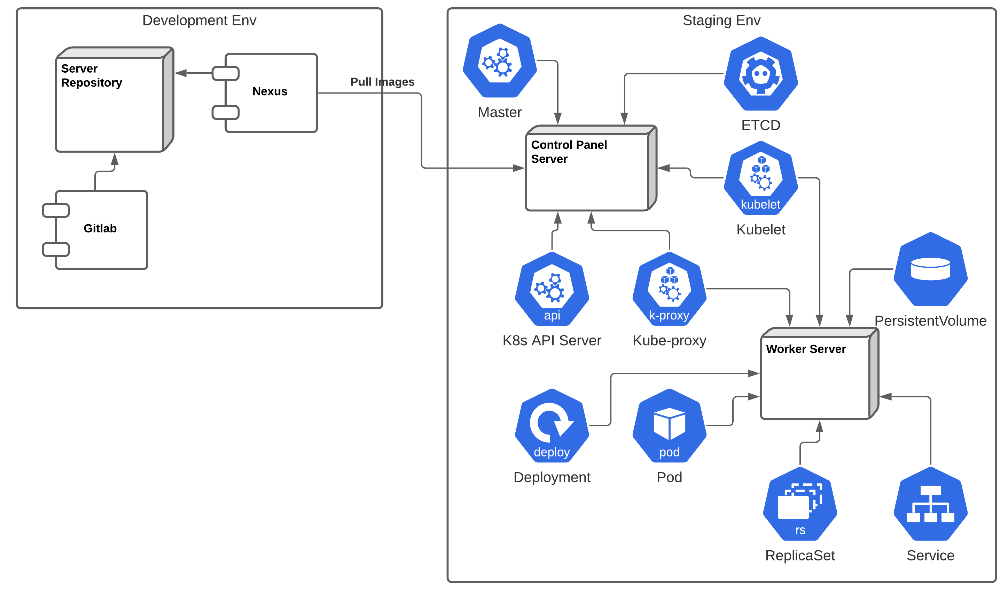
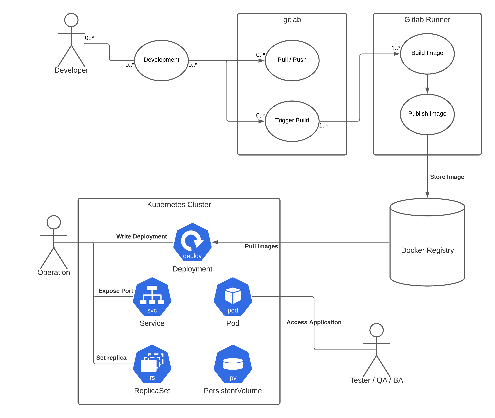
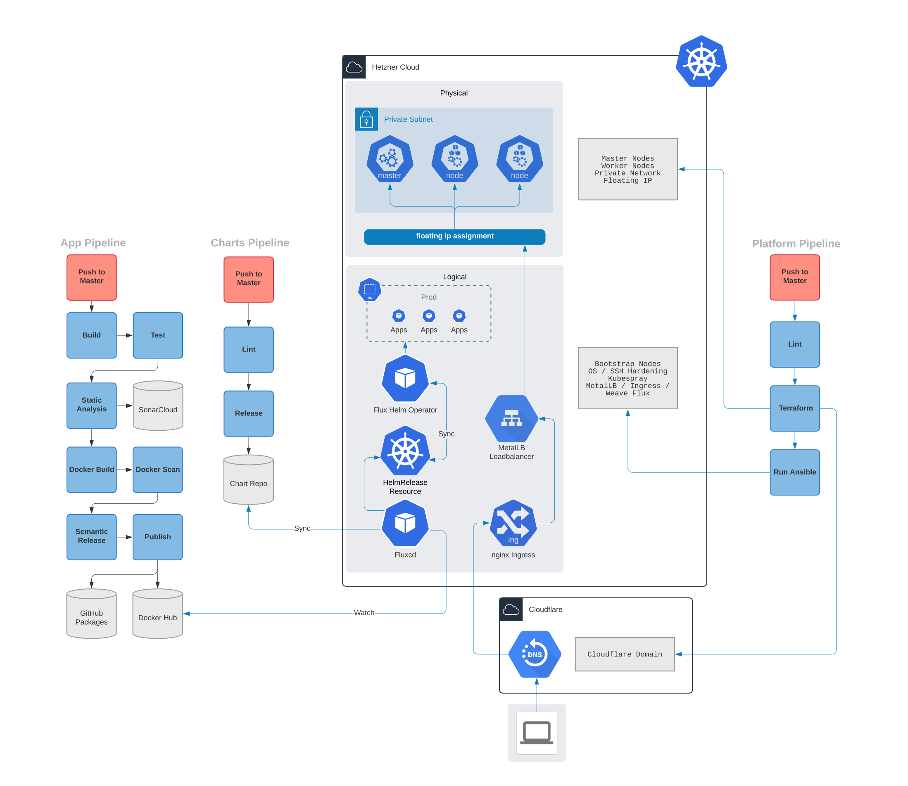
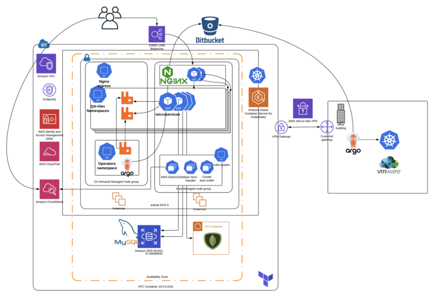

# CI/CD pipelines

- GitLab (preferred) 
- Jenkins (optional)
- FluxCD (GitOps : k8s)
- ArgoCD (GitOps : k8s)

### 1.GitLAB

GitLab & k8s overview:

GitLab & k8s DevOps workflow:

Example: Developing for Kubernetes with k3s+GitLab

https://github.com/adavarski/k3s-GitLab-development

Example: microservices application with Gitlab CI/CD pipelenes (build, test, release, deploy) to k8s (minikube)

https://github.com/adavarski/GitLab-microservices-k8s

REF:

- https://docs.gitlab.com/ee/user/project/clusters/add_remove_clusters.html
- https://docs.gitlab.com/runner/executors/kubernetes.html
- https://docs.gitlab.com/ee/ci/environments/

### 2.FluxCD (k8s) & ArgoCD (k8s) examples

FluxCD (HCloud):

ArgoCD example (AWS):

