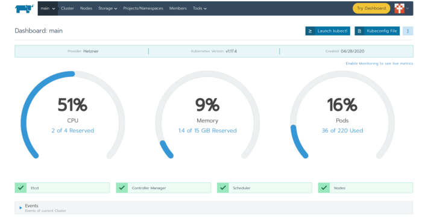

# Hetzner Cloud: Case Study/Research Solution Architecture

Using Hetzner as Cloud provider (for Cloud VMs & Dedicated Servers hosting). We want to launch Kubernetes, ScyllaDB and some other services across Hetzner Dedicated (bare-metal) and Hetzner Cloud VMs. We have to list the challenges we can identify from the services provided by Hetzner Cloud. Design the architecture for the environments. Research key technologies and configurations setup, so that Kubernetes and other services could be deployed (especially take into account how we would build environments security).


=======================================================================

# Objective: 

Hetzner is an inexpensive cloud services provider. Based in Germany, it offers great VPS (Hetzner Cloud VMs) servers and very cheap prices and also offers Hetzner Dedicated-Servers (bare-metal). We can use Hetzner Dedicated-Servers (bare-metal) for I/O intensive workloads/services which neededs huge amaount of IOPS (like OLTP DBs/DWHs/NoSQL DBs & Big Data/Data Lakes & Apache Spark & etc.). Ref: https://docs.hetzner.com/. 

Tasks:

- List the challenges we can identify from the services provided by Hetzner.
- Key technologies and configurations to setup (so that Kubernetes and other services could be deployed). 
- Launch Kubernetes, ScyllaDB and some other services across dedicated (bare-metal) and Cloud VMs. 
- Design outline the architecture for the environments. Take into account how you we build security into the environments


## Prerequisites: Hetzner Cloud registration 

Prepare your [Hetzner Account](https://accounts.hetzner.com/signUp) and get API token. 

First thing we need is an Hetzner account (https://accounts.hetzner.com/signUp). Sign-up, enter your credit card or PayPal and login to Hetzner UI/consle: https://accounts.hetzner.com/login


## List the challenges you can identify from the services provided by Hetzner

Hetzner Cloud Chalenges: 

- Network related : vSwitch & VLANS setup, DR/DRP setup, DNS setup
- Security related : VPNs setup, Firewalls setup
- K8S related : k8s Hetzner Cloud Controller Manager & k8s Hetzner Cloud Storage (CSI) deploy/setup; k8s Clusters external access: Using Hetzner cloud native load balancer with Kubernetes support or using (OPTIONAL): HCloud IP Floater + MetalLB + Hetzner Floating IP (k8s FIP controller).
- ScyllaDB releated: Run ScyllaDB using k8s operator inside k8s cluster. Run ScyllaDB using Cloud VMs/Dedicated-Servers.
- (OPTIONAL) Virtualization related (ProxMox/VMWare) 

See bellow design outlines/solutions.

##  1.Network: Hetzner Cloud 

### 1.1.Hetzner vSwitch: 

Use Hetzner vSwitch to enable cloud and dedicated root servers to reach each other via their private network links (vSwith between CloudVMs_to_Dedicated-Servers & Dedicated-Servers_to_Dedicated-Servers) 

vSwitch Overview (Summary):


vSwitch Rough overview:


vSwitch example of a coupled configuration:


For setup Hetzner vSwitch & Hetzner Cloud infrastructure use References: 

- https://docs.hetzner.com/cloud/networks/connect-dedi-vswitch/ 
- https://docs.hetzner.com/robot/dedicated-server/network/vswitch/ 
- https://docs.hetzner.com/cloud/networks/server-configuration/) 

### 1.2. DR/DRP setup : Hetzner Cloud

Use Hetzner Cloud multiple location for infrastructure provisioning and for Disaster Recovery(DR). Create/test Disaster Recovery Procedures (DRP)

Hetzner Cloud locations:

- Data Center Park Nuremberg, Germany
- Data Center Park Falkenstein, Germany
- Data Center Park Helsinki, Finland

Note: Provisioned the servers/CloudVMs with IaC tools like terraform/ansible/hcloud-cli/etc. in multiple Hetzner Cloud locations -> examples: ('nbg1', 'fsn1' or 'hel1'). 

### 1.3. DNS : Hetzner Cloud

Configure DNS records for all Dedicated Servers/VMs/Load Balansers/k8s Ingress/etc.

Ref: 
- https://docs.hetzner.com/robot 
- https://docs.hetzner.com/cloud/servers/cloud-server-rdns 

## 2.Security : Hetzner Cloud  (& Home/On-Prem infrastructure)

### 2.1.VPNs 

Note: VPN setup is OPTIONAL for Hetzner Cloud, because we will use only private networks and Hetzner vSwitch to enable cloud and dedicated root servers to reach each other via their private network links. We can use Wireguard, OpenVPN, Pfsence (IPSEC & OpenVPN), etc. for Hetzner Cloud <-> On-Prem/Home infrastructure.

Will use WireGuard VPN as example for better security for Hetzner Cloud infrastructucture: CloudVM_to_CloudVM/CloudVMs_to_Dedicated-Servers and CloudVMs&Dedicated_Servers_to_On-Prem/Home_Servers&VMs

WireGuard is a fast, secure VPN, easy to install, configure, and route all internal/k8s clusters traffic through. We need to generating public and private keys for each server/VM, adding a WireGuard configuration file, starting the service. For k8s cluster we need to create/setup an overlay network to tunnel Kubernetes traffic through.

Wireguard setup with Hetzner Cloud & Home/On-Prem infrastructure (networks):


Note1: For k8s inside Hetzner Cloud we can use only private networks and wireguard (OPTIONAL) for better security. 

Note2: For k8s development clusters we can use k3s. k3s is 40MB binary that runs “a fully compliant production-grade Kubernetes distribution” and requires only 512MB of RAM. k3s is a great way to wrap applications that you may not want to run in a full production Cluster but would like to achieve greater uniformity in systems deployment, monitoring, and management across all development operations. It is closer to a production style deployment. By default, K3s will run with flannel as the CNI, using VXLAN as the default backend. To change the flannel backend use --flannel-backend=wireguard option (Uses the WireGuard backend which encrypts network traffic. Require additional kernel modules and configuration). 

Note3: We can use Kilo, a multi-cloud network overlay built on WireGuard and designed for Kubernetes for other k8s clusters (not k3s-based dev clusters, example: RKE/Ranchier/kubespray/etc.).  Ref: https://kilo.squat.ai/docs/introduction

The topology and configuration of a Kilo network (Wireguard full network connections) example:


Example: Generate a graph of the Kilo network in Graphviz format "kgctl graph | circo -Tsvg > cluster.svg"


### 2.2. Firewalls: Setup firewall rules via shell scripts, using hcloud-cli util.

Examples(k8s-related):
```
### Example1:
hcloud firewall create --name firewall-kubernetes
hcloud firewall add-rule firewall-kubernetes --description "Allow SSH In" --direction in --port 22 --protocol tcp --source-ips 0.0.0.0/0 --source-ips ::/0
hcloud firewall add-rule firewall-kubernetes --description "Allow ICMP In" --direction in --protocol icmp --source-ips 0.0.0.0/0 --source-ips ::/0
hcloud firewall add-rule firewall-kubernetes --description "Allow ICMP Out" --direction out --protocol icmp --destination-ips 0.0.0.0/0 --destination-ips ::/0
hcloud firewall add-rule firewall-kubernetes --description "Allow DNS TCP Out" --direction out --port 53 --protocol tcp --destination-ips 0.0.0.0/0 --destination-ips ::/0
hcloud firewall add-rule firewall-kubernetes --description "Allow DNS UDP Out" --direction out --port 53 --protocol udp --destination-ips 0.0.0.0/0 --destination-ips ::/0
hcloud firewall add-rule firewall-kubernetes --description "Allow HTTP Out" --direction out --port 80 --protocol tcp --destination-ips 0.0.0.0/0 --destination-ips ::/0
hcloud firewall add-rule firewall-kubernetes --description "Allow HTTPS Out" --direction out --port 443 --protocol tcp --destination-ips 0.0.0.0/0 --destination-ips ::/0
hcloud firewall add-rule firewall-kubernetes --description "Allow NTP UDP Out" --direction out --port 123 --protocol udp --destination-ips 0.0.0.0/0 --destination-ips ::/0
hcloud firewall apply-to-resource firewall-kubernetes --type server --server master-1
hcloud firewall apply-to-resource firewall-kubernetes --type server --server node-1
hcloud firewall apply-to-resource firewall-kubernetes --type server --server node-2

### Example2:
$ hcloud firewall add-rule k8s-nodes --protocol=tcp --direction=in --source-ips <116.203.0.1>/32 --source-ips <116.203.0.2>/32 --source-ips <116.203.0.3>/32 --port any
$ hcloud firewall add-rule k8s-nodes --protocol=udp --direction=in --source-ips <116.203.0.1>/32 --source-ips <116.203.0.2>/32 --source-ips <116.203.0.3>/32 --port any
```

## 3. Kubernetes: Hetzner Cloud 

Hetzner is ideal for setting up a Kubernetes Clusters on VPS (Hetzner Cloud VMs)/Dedicated-Servers (bare-metal) and also Hetzner becomes a 100% Kubernetes solution resently (with features like k8s Hetzner Cloud Controller Manager & Hetzner Cloud Storage (CSI) and adding cloud native load balancer with Kubernetes support).

Kubernetes is a container orchestration tool developed by Google which helps to deploy software solutions with complex architectures like microservices. Since its launch in 2014 it has experienced great growth and a it’s a key piece of many DevOps/Dev/QA/Production infrastructures. With Kubernetes (k8s) cluster management is very easy.

Note: k8s clusters provisioning/deploy : 

- kubespray/Rancher/RKE for k8s PRODUCTION clusters running on hcloud dedicated servers or VMs (we will use terraform/ansible(optional) for provisioning infrastructure) 
- k3s (for k8s DEVELOPMENT/QA clusters/environments) or kubeadm-based/RKE-based/Rancher-based k8s clusters running on Hetzner CloudVMs or Home/On-Prem infra. 
- Use k8s Operators/Helm Charts/YAML manifests for creating k8s deployments/workloads (PaaS/SaaS services).

### 3.2. Deploy the Hetzner Cloud Controller Manager (CCM)
In order to integrate with Hetzner Cloud they have developed a “Kubernetes Cloud Controller Manager”. This will need access to the Hetzner Cloud, so we need to create another API Token.

To create a Hetzner Cloud API token log in to the web interface, and navigate to your project -> Access -> API tokens and create a new token.

Now we create a secret in Kubernetes with that token. To do that (you’ll have to get the network id) 
```
hcloud network list
```
```
cat <<EOF | kubectl apply -f -
apiVersion: v1
kind: Secret
metadata:
  name: hcloud
  namespace: kube-system
stringData:
  token: "<the api token you created just yet>"
  network: "<network-id>"
EOF
```
Now we can deploy the controller
```
kubectl apply -f  https://raw.githubusercontent.com/hetznercloud/hcloud-cloud-controller-manager/master/deploy/v1.5.1.yaml
```
### 3.3. Deploy Hetzner Cloud Storage (CSI)

To use those PVC you need in most of the applications, you need to deploy a CSI. Hetzner wrote a driver for that as well.

Create or reuse the API token from the previous step and create a secret for the driver.
```
cat <<EOF | kubectl apply -f -
apiVersion: v1
kind: Secret
metadata:
  name: hcloud-csi
  namespace: kube-system
stringData:
  token: "<the api token you created just yet>"
EOF
```
Now deploy the api and the driver
```
kubectl apply -f https://raw.githubusercontent.com/kubernetes/csi-api/release-1.14/pkg/crd/manifests/csidriver.yaml
kubectl apply -f https://raw.githubusercontent.com/kubernetes/csi-api/release-1.14/pkg/crd/manifests/csinodeinfo.yaml

kubectl apply -f https://raw.githubusercontent.com/hetznercloud/csi-driver/v1.2.3/deploy/kubernetes/hcloud-csi.yml
```

Now you should be able to deploy new applications with storage capability (volumes). But in order to access these, you would need an entry point from the internet like NodePorts, but there is already a better solution: LoadBalancer/Ingress.

### 3.4. k8s Clusters external access (access the workloads/applications, deployed on Kubernetes).

One primary goal of the server is to serve websites/apps. To access services inside a Kubernetes cluster you have to open it up somewhere. You can do this by opening a NodePort, but that will open only on the Node running the pod. When that node goes down, your application won’t be accessible under the same public ip as it was before, which might not be what you want.

LoadBalancer to the rescue. You need a LoadBalancer outside the Kubernetes Cluster, which has an IP address and routes the traffic to all nodes serving the application.

A LoadBalancer is also a requirement to deploy an k8s Ingress Controller/Resources like NGINX/Traefik/etc., which you want to use for your Web traffic.

Deploy NGINX Ingesss Controler Example:
```
kubectl apply -f https://raw.githubusercontent.com/kubernetes/ingress-nginx/master/deploy/static/mandatory.yaml
```

#### 3.4.1.Using Hetzner cloud native load balancer with Kubernetes support

We are going to create a Kubernetes cluster using Load Balancer service already available in Hetzner. Hetzner added a cloud native load balancer with Kubernetes support and becomes a 100% Kubernetes solution resently.


Note1.: Hetzner Load Balancer at glance

The new and claimed Load Balancer (LB) service has a entry level price of 4.9€/mo. Not so bad. For that price you have a LB with a traffic support up to 20 TB/mo, 5 services (“ports”) and 25 targets (nodes). It’s enough for small/medium production services.

For more details visit “Load Balancer — Hetzner Online GmbH” ->  Ref: https://www.hetzner.com/cloud/load-balancer
Hetzner has its own Kubernetes cloud controller manager and now includes the LB support -> Ref: https://github.com/hetznercloud/hcloud-cloud-controller-manager

Note2: Cloud provider
Kubernetes implements by default the major cloud providers: AWS, Azure, GCP, … This let’s to create or destroy new nodes, volumes or load balancers on demand.
For the rest of cloud providers, Kubernetes includes a interface that the cloud provider must implement to give support it. In this case, when we create the cluster we must specify the cloud provider as external and later apply the 3th-party cloud-controller-manager manifest (Hetzner in our case).

Example (see Appendix_2 for details): We use Rancher to create the cluster. First we specify our needs using the UI. Under “Kubernetes options” we select “External” in “Cloud provider”

Now we switch into YAML mode to add the following as k8s addons:
- A Hetzner API Token as secret.
- The Hetzner cloud-controller-manager manifest URL.
The addons and addons_include are children of rancher_kubernetes_engine_config. Take care of the indentation.

```
...
rancher_kubernetes_engine_config:
  ...
  addons: |-
    ---
    apiVersion: v1
    stringData:
      token: <YOUR-HETZNER-API-TOKEN>
    kind: Secret
    metadata:
      name: hcloud
      namespace: kube-system
  addons_include:
    - https://raw.githubusercontent.com/hetznercloud/hcloud-cloud-controller-manager/master/deploy/v1.7.0.yaml
...
```
Remember replace <YOUR-HETZNER-API-TOKEN> with the yours!

Now click on “Create” and wait for the cluster creation.
If something goes wrong, you can apply the secret and manifest after.

Usage:
  
We demonstrate its usage with the ingress-nginx controller.
First we create our first load balancer in the Hetzner UI (or using hcloud-cli)

Just select your preferred location, give a name (remember that name!) and press on “Create & Buy now”.
  
Now we need to edit ingress service definition and put the right annotations and service type:

```
  ...
metadata:
  ...
  annotations:
    load-balancer.hetzner.cloud/name: "<YOUR-LB-NAME>"
    load-balancer.hetzner.cloud/health-check-port: "<YOUR-INGRESS-HEALTH-PORT>"
spec:
  ...
  type: LoadBalancer
```
It’s very important to set-up the right health check port.You can view it the ingress-nginx manifest.
You can check the full list of annotations directly from the source code in GitHub (ref: https://github.com/hetznercloud/hcloud-cloud-controller-manager/blob/master/internal/annotation/load_balancer.go#L13)
  
Check Load Balancer Control Panel on Hetzner, if it works.

Note (old way provisioning, before Hetzner Cloud provider have a native cloud load balancer in its portfolio) : You can also provision a load balancer by creating a service of type LoadBalancer with the load-balancer.hetzner.cloud/location annotation. This should be set to the same location you provisioned the servers under ('nbg1', 'fsn1' or 'hel1'). As we've set up a private network for our servers, you can also use the load-balancer.hetzner.cloud/use-private-ip annotation to route traffic through it. Please keep in mind, the default datacenter where we deploys is nbg1. So having this in mind here's example manifest:
```
apiVersion: v1
kind: Service
metadata:
  name: example-svc
  annotations:
    load-balancer.hetzner.cloud/location: nbg1 ###### <<<<<< ----- IMPORTANT
    load-balancer.hetzner.cloud/use-private-ip: "true"
spec:
  selector:
    app: example
  ports:
    - port: 80
      targetPort: 8080
  type: LoadBalancer
```

#### 3.4.2.(OPTIONAL): HCloud IP Floater + MetalLB + Hetzner Floating IP (k8s FIP controller) + k8s Ingress Controller. 

Note1: NOT RECOMMENDED!, because Hetzner cloud has native load balancer with Kubernetes support. 
Note2: If you don’t want to use the cloud native Hetzner Load Balance service, you can use the software solution MetalLB. To achieve a “LoadBalancer” service in an Hetzner Kubernetes cluster use a software solution like as MetalLB. 
Note3: 2 master k8s nodes in different regions/data centers


A LoadBalancer is also a requirement to deploy an Ingress Resource implementation like NGINX, which you want to use for your Web traffic.

One key aspect is the floating ip, which will represent our public IP address for the LoadBalancer. But how can we setup the LoadBalancer? This is where MetalLB takes the stage. It needs just some public IPs to hand out and implements a LoadBalancer using standard routing mechanisms. But Hetzner doesn’t support handing out IPs from outside its reach, it only supports assigning it to one node (floating ip). So we will use only that one floating IP from Hetzner for reasonable price. That floating IP can only be assigned to one node, but what happens, when that node goes down for whatever reason? Yes, all applications on that public IP won’t be available. Bummer! Thanks to C.Beneke there is hope. The hcloud fip controller checks if any node goes down and assignes that floating ip to a running node, thus saving us from down-time!

With all that in place, you’ll have a virtual LoadBalancer integrating in the Hetzner Cloud environment. It’s not an ideal solution, but the best we can get so far. Maybe Hetzner will allow us creating LoadBalancers in the future?!?

Our new solution looks like this:


Now we want to implement this and also installing the NGINX Ingress Resource Implementation in order to be able to create Ingress resources in our cluster, enabling us to easily serve websites in our cluster!

#### Prerequisites
You should have setup the Kubernetes cluster on Hetzner cloud as I described in my previous blog post.

#### Create a floating ip using
```
hcloud floating-ip create --type ipv4 --home-location nbg1 --name public-ip
```
or using the web-interface - floating ips - add floating ip

#### Configure floating IP on every node
In order to use the floating IP, you’ll have to configure it on each worker node separately
```
cat <<EOF > /etc/sysconfig/network-scripts/ifcfg-eth0:1
BOOTPROTO=static
DEVICE=eth0:1
IPADDR=<your-floating-ip-goes-here>
PREFIX=32
TYPE=Ethernet
USERCTL=no
ONBOOT=yes
EOF
```

then you should restart the network configuration:
```
systemctl restart network.service
```

#### Install MetalLB
Install MetalLB by applying the Manifest
```
kubectl apply -f https://raw.githubusercontent.com/google/metallb/v0.8.3/manifests/metallb.yaml
```
You could also install it by using kustomize (Helm is unfortunately not supported anymore), please see https://metallb.universe.tf/installation/ for instructions to do so.

Now you only have to configure your floating IP in MetalLB
```
cat <<EOF |kubectl apply -f-
apiVersion: v1
kind: ConfigMap
metadata:
  namespace: metallb-system
  name: config
data:
  config: |
    address-pools:
    - name: default
      protocol: layer2
      addresses:
      - <your-floating-ip-goes-here>/32
EOF
```

#### Install the FIP Controller
To implement the automatic failover mechanism, install the FIP controller.

Create a new Namespace and deploy the FIP controller into it.
```
kubectl create namespace fip-controller
kubectl apply -f https://raw.githubusercontent.com/cbeneke/hcloud-fip-controller/master/deploy/rbac.yaml
kubectl apply -f https://raw.githubusercontent.com/cbeneke/hcloud-fip-controller/master/deploy/deployment.yaml
```

Since it need to access the Hetzner Cloud API, you’ll need another API token (or you can reuse one already created before)

To create a Hetzner Cloud API token log in to the web interface, and navigate to your project -> Access -> API tokens and create a new token.

Now we can configure FIP with that Token and our floating IP
```
cat <<EOF | kubectl apply -f -
apiVersion: v1
kind: ConfigMap
metadata:
  name: fip-controller-config
  namespace: fip-controller
data:
  config.json: |
    {
      "hcloud_floating_ips": [ "<your-floating-ip-goes-here>" ]
    }
---
apiVersion: v1
kind: Secret
metadata:
  name: fip-controller-secrets
  namespace: fip-controller
stringData:
  HCLOUD_API_TOKEN: "<the api token you created just yet>"
EOF
```

#### Install NGINX Ingress Controller
To serve web pages, we will deploy a NGINX Ingress Controller. Which is basically a Service Type: LoadBalancer and can route traffic to multiple endpoints/services.

You’ll deploy NGINX Ingress Controller with
```
kubectl apply -f https://raw.githubusercontent.com/kubernetes/ingress-nginx/master/deploy/static/mandatory.yaml
```
and since we used MetalLB we create a Service pointing to the NGINX Ingress Controller
```
cat <<EOF | kubectl apply -f -
kind: Service
apiVersion: v1
metadata:
  name: ingress-nginx
  namespace: ingress-nginx
  annotations:
    metallb.universe.tf/allow-shared-ip: "floating-ip"
  labels:
    app.kubernetes.io/name: ingress-nginx
    app.kubernetes.io/part-of: ingress-nginx
spec:
  type: LoadBalancer
  selector:
    app.kubernetes.io/name: ingress-nginx
    app.kubernetes.io/part-of: ingress-nginx
  ports:
    - name: http
      port: 80
      targetPort: http
    - name: https
      port: 443
      targetPort: https
EOF
```

Now we can deploy Ingress resources and pointing our browser to http://<floating-ip-address>/<whatever>, we will see that deployed application.

But we don’t like entering IP addresses to browsers, which is why there is DNS. 

Ref:
  
- https://www.hetzner.com/cloud/load-balancer
  

## 4.Key technologies & Tools for building environments/infrastructure on Hetzner Cloud   

We want to launch Kubernetes, ScyllaDB and some other services across dedicated (bare-metal) and Cloud VMs. Create an outline how you would design the architecture for the environment, which key technologies and configurations you would setup so that Kubernetes and other services could be deployed. Especially take into account how you would build in security into the environment

Ref: 
  
- https://github.com/hetznercloud : Usefull repos.
- https://github.com/hetznercloud/awesome-hcloud: List of awesome libraries, tools, and integrations for Hetzner Cloud)

### 4.1. IaC & CM: terraform & ansible & hcloud-cli

- https://github.com/hetznercloud/cli -> A command-line interface for Hetzner Cloud (Example: apt install hcloud-cli)

- https://github.com/hetznercloud/terraform-provider-hcloud -> Terraform Hetzner Cloud provider

Example:

export HCLOUD_TOKEN="YOUR HETZNER TOKEN"

cd terraform
terraform apply

cd ../ansible
ansible-playbook -i inventory/hosts.ini setup-environment.yml

### 4.2.k8s on Hetzner Cloud: 

k8s clusters provisioning/deploy : 

- Kubespray/Rancher for k8s PRODUCTION clusters provisioning on Hetzner CloudVMs.
- k3s (for k8s DEVELOPMENT/QA clusters/environments) or kubeadm-based/Rancher-based/RKE-based k8s clusters running on Hetzner CloudVMs or On-Prem/Home infrastructure
- We will use terraform/ansible(OPTIONAL) for provisioning infrastructure 
- We will us k8s Operators/Helm Charts/YAML manifests for creating k8s deployments/workloads (for PaaS/SaaS services).

Note: Use https://registry.terraform.io/providers/hetznercloud/hcloud/latest/docs to provision k8s CloudVMs

See Appendixes for k3s-base, kubeadm-based, ranchier-based DEVELOPMENT k3s clusters provisioning/setup && kubespray/ranchier for PRODUCTION k3s clusters provisioning/setup.

- Appendix_1: k8s development cluster install/setup using k3s (withoud WireGuard, only private network) 
- Appendix_2: Create a Kubernetes cluster with Rancher on Hetzner Cloud for Development 
- Appendix_3: WireGuard VPN setup, k8s development cluster install/setup using kubeadm and setup k8s cluster with Wireguard VPN
- Appendix_4: hcloud k8s cluster setup with kubeadm for DEVELOPMENT environments (Note: use only privete hcloud network, not using Wireguard):
- Appendix_5: hcloud k8s Production Ready Kubernetes Clusters setup using kubespray (2 k8s Mastes in different regions) 


## 5.Virtualization options for k8s/etc. on Hetzner Cloud (OPTIONAL) - Proxmox & Vmware on Dedicated Servers (for dev/qa)

We can use some virtualization on Hetzner Cloud Dedicated Servers(bare-metal)

### 5.1.Proxmox on hcloud (k8s VMs on ProxMox:masters&workers): 

Ref:

https://community.hetzner.com/tutorials/install-and-configure-proxmox_ve
https://github.com/adavarski/proxmox-terraform-k8s

Note: ProxMox (for DEV clusters): We can create VMs with Terraform and after that setup ansible inventory with IPs of VMs, and create k8s cluster with Kubespray (REF: https://github.com/kubernetes-sigs/kubespray) or using ansible playbooks with kubeadm.

### 5.2.VMWARE (ESXi/vSphere) on dedicated server (k8s VMs on VMWARE:masters&workers)

https://docs.hetzner.com/robot/dedicated-server/virtualization/vmware-esxi/
https://community.hetzner.com/tutorials/install-and-configure-vmware-vsphere
https://community.hetzner.com/tutorials/install-and-configure-routervm-for-vmware-vsphere
https://github.com/adavarski/k8s-vmware-terraform-kubespray (with MetalLB for k8s ingress)

Note: We need some licenses for vSphere if we want to use Terraform, because Terraform modules need VMWare vSphere installation and setup. Also I've not been using VMWARE for more than 10 years actively, because I prefer open source private clouds (OpenStack, Apache CloudStack, etc.)

### 5.3.Vagrant+VirtualBox/KVM (for DEV clusters) running on a single dedicated hcloud server.

Note1:  KVM is hard to support
Note2:  MetalLB (https://metallb.universe.tf/: MetalLB is a load-balancer implementation for bare metal Kubernetes clusters will be very hard to be hacked with such Vagrant+VirtualBox/KVM setups. 

## 6.ScyllaDB

We will use k8s operator for this and deploy ScyllaDB on k8s. Ref: [Apppendix 6](https://github.com/adavarski/Hetzner-Case-Study/blob/main/README.md#Appendix_6-scylla-on-k8s) for details.

## 7. CI/CD: GitLab/Jenkins/etc.
  
GitLab can be integrated (Add existing k8s cluster) with kubernetes versions < v1.19. Gitlab can be run inside k8s or on CloudVM/Dedicated Server.

GitLab supports the following Kubernetes versions, and you can upgrade your Kubernetes version to any supported version at any time:

1.19 (support ends on February 22, 2022)
1.18 (support ends on November 22, 2021)
1.17 (support ends on September 22, 2021)

The helm tiller can't be installed in kubernetes v1.18.+ because is not supported Gitlab versions (helm tiller install issue, and helm is needed for all the other GitLab sub apps depend on Helm Tiller: you cannot use cert manager, ingress, etc.) :

Ref (GitLab example) : Integrate k8s cluster with GitLab (GitOps) & Deploy in-Cluster GitLab for K8s Development HOWTO (Developing for Kubernetes with k3s+GitLab): https://github.com/adavarski/k3s-GitLab-development
Ref (Jenkins example): https://github.com/adavarski/jenkins-dev-environment
 
Note: GitOps

New concepts like GitOps aim to completely manage the active configuration state directly with Git. GitOps, a process popularized by Weaveworks, is another trending concept within the scope of Kubernetes CI/CD. GitOps involves the use of applications reacting to git push events. GitOps focuses primarily on Kubernetes clusters matching the state described by configuration (www.weave.works/technologies/gitops/ ; www.gitops.tech/) residing in a Git repository. On a simplistic level, GitOps aims to replace kubectl apply with git push. Popular and well-supported GitOps implementations include ArgoCD, Flux, and Jenkins X, GitLAb. GitLab k8s integration supports GitOps.

GitOps, a process popularized by Weaveworks, is another trending concept within the scope of Kubernetes CI/CD. GitOps involves the use of applications reacting to git push events. GitOps focuses primarily on Kubernetes clusters matching the state described by configuration residing in a Git repository. On a simplistic level, GitOps aims to replace kubectl apply with git push. Popular and well-supported GitOps implementations include GitLab, ArgoCD, Flux, and Jenkins X. Argo CD (GitOps): We can configure argo to run deployments for us instead of kubectl apply -f. 


### Appendix_1: k3s-based Kubernetes development cluster on Hetzner Cloud (private network) 

This appendix/tutorial will guide you through setting up a Kubernetes cluster using K3S. K3S is a lightweight Kubernetes distribution which is perfectly suited for the small Hetzner VMs like the CX11. Additionally, you will set up Hetzner's cloud native load balancer with Kubernetes support, which performs SSL offloading and forwards traffic to your Kubernetes system. Optionally, you will learn how to set up a distributed, replicated file system using GlusterFS. This allows you to move pods between the nodes while still having access to the pods' persistent data.  
                                                                                        
#### Prerequisites

This appendix/tutorial assumes you have set up Hetzner's CLI utility (hcloud) which has access to a Hetzner cloud project in your account.
We will set up a K3S Kubernetes cluster with one server node and two agent nodes. Hetzner's highly available load balancer will delivers traffic to our system and performs HTTPS offloading. We'll be ready to put some workload on our K3S.
  
The following terminology is used in this tutorial:
```
Domain: <example.com>
SSH Key: <your_ssh_key>
Random secret token: <your_secret_token>
Hetzner API token: <hetzner_api_token>

IP addresses (IPv4):

K3S Master: 10.0.0.2
K3S Node 1: 10.0.0.3
K3S Node 2: 10.0.0.4
Hetzner Cloud Load Balancer: 10.0.0.254  
```  
```  
#### Step 1 - Create private network
First, we'll create a private network which is used by our Kubernetes nodes for communicating with each other. We'll use 10.0.0.0/16 as network and subnet.

hcloud network create --name network-kubernetes --ip-range 10.0.0.0/16
hcloud network add-subnet network-kubernetes --network-zone eu-central --type server --ip-range 10.0.0.0/16

#### Step 2 - Create placement group and servers
  
Next, we'll create a "spread" placement group for our servers and then the VMs.

##### Step 2.1 - Create the spread placement group (optional)
The placement group ensures your VMs run on different hosts, so in case on host has a failure, no other VMs are affected.

hcloud placement-group create --name group-spread --type spread
                                                                                          
##### Step 2.2 - Create the virtual machines
                                                                                          
We'll use Debian 10 here. At the time of writing, there seems to be a bug with Debian 11 which prevents K3S from using VXLAN to communicate between the nodes. See: https://github.com/k3s-io/k3s/issues/3863

hcloud server create --datacenter nbg1-dc3 --type cx11 --name master-1 --image debian-10 --ssh-key <your_ssh_key> --network network-kubernetes --placement-group group-spread
hcloud server create --datacenter nbg1-dc3 --type cx11 --name node-1 --image debian-10 --ssh-key <your_ssh_key> --network network-kubernetes --placement-group group-spread
hcloud server create --datacenter nbg1-dc3 --type cx11 --name node-2 --image debian-10 --ssh-key <your_ssh_key> --network network-kubernetes --placement-group group-spread
  
#### Step 3 - Create and apply firewall
Now that our servers are up and running, let's create a firewall and restrict ingoing and outgoing traffic. You may need to customize the rules to match your requirements.

Create the firewall:

hcloud firewall create --name firewall-kubernetes

Allow incoming SSH and ICMP:

hcloud firewall add-rule firewall-kubernetes --description "Allow SSH In" --direction in --port 22 --protocol tcp --source-ips 0.0.0.0/0 --source-ips ::/0
hcloud firewall add-rule firewall-kubernetes --description "Allow ICMP In" --direction in --protocol icmp --source-ips 0.0.0.0/0 --source-ips ::/0

Allow outgoing ICMP, DNS, HTTP, HTTPS and NTP:

hcloud firewall add-rule firewall-kubernetes --description "Allow ICMP Out" --direction out --protocol icmp --destination-ips 0.0.0.0/0 --destination-ips ::/0
hcloud firewall add-rule firewall-kubernetes --description "Allow DNS TCP Out" --direction out --port 53 --protocol tcp --destination-ips 0.0.0.0/0 --destination-ips ::/0
hcloud firewall add-rule firewall-kubernetes --description "Allow DNS UDP Out" --direction out --port 53 --protocol udp --destination-ips 0.0.0.0/0 --destination-ips ::/0
hcloud firewall add-rule firewall-kubernetes --description "Allow HTTP Out" --direction out --port 80 --protocol tcp --destination-ips 0.0.0.0/0 --destination-ips ::/0
hcloud firewall add-rule firewall-kubernetes --description "Allow HTTPS Out" --direction out --port 443 --protocol tcp --destination-ips 0.0.0.0/0 --destination-ips ::/0
hcloud firewall add-rule firewall-kubernetes --description "Allow NTP UDP Out" --direction out --port 123 --protocol udp --destination-ips 0.0.0.0/0 --destination-ips ::/0
                                                                                          
Apply the firewall rules to all three servers:

hcloud firewall apply-to-resource firewall-kubernetes --type server --server master-1
hcloud firewall apply-to-resource firewall-kubernetes --type server --server node-1
hcloud firewall apply-to-resource firewall-kubernetes --type server --server node-2

#### Step 4 - Install K3S
It's showtime for K3S. Before we prepare our master node and agent nodes, first upgrade the system and install AppArmor. SSH into your newly created VMs and run this command on all of then:

apt update
apt upgrade -y
apt install apparmor apparmor-utils -y

##### Step 4.1 - Install K3S on master node
SSH into your master node and run the following command to install and start the K3S server:

curl -sfL https://get.k3s.io | sh -s - server \
    --disable-cloud-controller \
    --disable metrics-server \
    --write-kubeconfig-mode=644 \
    --disable local-storage \
    --node-name="$(hostname -f)" \
    --cluster-cidr="10.244.0.0/16" \
    --kube-controller-manager-arg="address=0.0.0.0" \
    --kube-controller-manager-arg="bind-address=0.0.0.0" \
    --kube-proxy-arg="metrics-bind-address=0.0.0.0" \
    --kube-scheduler-arg="address=0.0.0.0" \
    --kube-scheduler-arg="bind-address=0.0.0.0" \
    --kubelet-arg="cloud-provider=external" \
    --token="<your_secret_token>" \
    --tls-san="$(hostname -I | awk '{print $2}')" \
    --flannel-iface=ens10
  
You can read more about the applied options in the K3S documentation. In short:

We disable the integrated cloud controller because we'll install Hetzner's Cloud Controller Manager in the next step.
We disable the metrics server to save some memory.
We disable the local storage because we'll use GlusterFS.
We set the Cluster CIDR to 10.244.0.0/16.
We make Kube Controller, Kube Proxy and Kube Scheduler listen on any address (which is not an issue as we've applied firewall rules and the nodes communicate with each other using the private network).
We set the shared secret token to <your_secret_token>.
We add the server's private IPv4 (should be 10.0.0.2) as an additional subject name to the TLS cert.
We make Flannel use ens10, which should be the interface of our private network.
                                                                                          
##### Step 4.2 - Install Hetzner Cloud Controller Manager
Still on your master node, install the Hetzner Cloud Controller Manager:

kubectl -n kube-system create secret generic hcloud --from-literal=token=<hetzner_api_token> --from-literal=network=network-kubernetes
kubectl apply -f https://github.com/hetznercloud/hcloud-cloud-controller-manager/releases/latest/download/ccm-networks.yaml

##### Step 4.3 - Install System Upgrade Controller (optional)
The System Upgrade Controller performs automatic updates of K3S. If you want to use this feature, install the controller using this command:

kubectl apply -f https://github.com/rancher/system-upgrade-controller/releases/latest/download/system-upgrade-controller.yaml

##### Step 4.4 - Install K3S on agent nodes
Now that our K3S server is up and running, SSH into your two agent nodes and run the following command to install the K3S agent and connect it to the server:

curl -sfL https://get.k3s.io | K3S_URL=https://10.0.0.2:6443 K3S_TOKEN=<your_secret_token> sh -s - agent \
    --node-name="$(hostname -f)" \
    --kubelet-arg="cloud-provider=external" \
    --flannel-iface=ens10
  
You can read more about the applied options in the K3S documentation. In short:

We disable the integrated cloud controller because we've already installed Hetzner's Cloud Controller Manager.
We make Flannel use ens10, which should be the interface of our private network.

#### Step 5 - Install GlusterFS (optional)
GlusterFS is a free and open source software scalable network filesystem. You can use it to replicate files to all your VMs so that your pods can access their persistent storage no matter which node they are running on. Alternatively, you can take a look at Longhorn or OpenEBS.

##### Step 5.1 - Prepare all nodes
SSH into all three nodes and run the following command to install, enable and start the Gluster server on all machines:

wget -O - https://download.gluster.org/pub/gluster/glusterfs/9/rsa.pub | apt-key add -
echo deb [arch=amd64] https://download.gluster.org/pub/gluster/glusterfs/9/LATEST/Debian/buster/amd64/apt buster main > /etc/apt/sources.list.d/gluster.list
apt update && apt install -y glusterfs-server
systemctl enable glusterd && systemctl start glusterd
  
Gluster works with so-called "bricks". A brick is a directory which is controlled by Gluster to manage the replicated file system. This file system is then mounted using GlusterFS. Create the necessary directories:

mkdir -p /data/glusterfs/k8s/brick1
mkdir -p /mnt/gluster-k8s

##### Step 5.2 - Set up the cluster
Only on your master node, add the two other nodes as peers:

gluster peer probe 10.0.0.3
gluster peer probe 10.0.0.4
  
Verify the peer status on the master and agent nodes:

gluster peer status

##### Step 5.3 - Create the volume
On your master node, run the following command to create and start a replicated volume:

gluster volume create k8s replica 3 \
    10.0.0.2:/data/glusterfs/k8s/brick1/brick \
    10.0.0.3:/data/glusterfs/k8s/brick1/brick \
    10.0.0.4:/data/glusterfs/k8s/brick1/brick \
    force
gluster volume start k8s
gluster volume info
  
This will create and start a replicated volume named "k8s" with three replicas (our three VMs).

##### Step 5.4 - Mount the GlusterFS volume
On all three nodes, mount the newly created GlusterFS volume:

echo "127.0.0.1:/k8s /mnt/gluster-k8s glusterfs defaults,_netdev 0 0" >> /etc/fstab
mount /mnt/gluster-k8s

#### Step 6 - Set up load balancing
We'll use Hetzner's load balancer for SSL offloading and for routing HTTP requests to your K3S setup.

##### Step 6.1 - Enable proxy protocol in Traefik
To use the proxy protocol, enable it in your K3S' Traefik configuration by setting the cloud load balancer as a trusted IP address:

cat <<EOF > /var/lib/rancher/k3s/server/manifests/traefik-config.yaml
apiVersion: helm.cattle.io/v1
kind: HelmChartConfig
metadata:
  name: traefik
  namespace: kube-system
spec:
  valuesContent: |-
    additionalArguments:
      - "--entryPoints.web.proxyProtocol.trustedIPs=10.0.0.254"
      - "--entryPoints.web.forwardedHeaders.trustedIPs=10.0.0.254"
EOF

##### Step 6.2 - Create the load balancer
Create the load balancer and attach it to the private network using the static private IP 10.0.0.254:

hcloud load-balancer create --type lb11 --location nbg1 --name lb-kubernetes
hcloud load-balancer attach-to-network --network network-kubernetes --ip 10.0.0.254 lb-kubernetes

Add your three VMs as targets and make sure traffic is routed using the private network:

hcloud load-balancer add-target lb-kubernetes --server master-1 --use-private-ip
hcloud load-balancer add-target lb-kubernetes --server node-1 --use-private-ip
hcloud load-balancer add-target lb-kubernetes --server node-2 --use-private-ip
  
Let Hetzner create a managed Let's Encrypt certificate for <example.com> and get the certificate ID <certificate_id>:

hcloud certificate create --domain <example.com> --type managed --name cert-t1
hcloud certificate list
Add the HTTP service for <example.com> using proxy protocol and enable the health check:

hcloud load-balancer add-service lb-kubernetes --protocol https --http-redirect-http --proxy-protocol --http-certificates <certificate_id>
hcloud load-balancer update-service lb-kubernetes --listen-port 443 --health-check-http-domain <example.com>
  
This will route HTTP requests from Hetzner's load balancer (which performs SSL offloading) to your Kubernetes' Traefik reverse proxy, which in turn routed the request to configured ingress routes. Alternatively, you can route incoming HTTP requests directly from Hetzner's load balancer to an exposed service in your Kubernetes cluster, skipping Traefik. We've chosen to use Traefik as it i.e. allows me to set additional HTTP response headers.

#### Step 7 - Test your setup (optional)
Your K3S setup is now complete. It's time to test your setup by deploying an nginx pod and publish the HTTP service via K3S' integrated Traefik.

##### Step 7.1 - Write to GlusterFS volume
Create a static index.html file:

mkdir /mnt/gluster-k8s/webtest1
echo "Hello World!" > /mnt/gluster-k8s/webtest1/index.html

##### Step 7.2 - Deploy a webserver
Create an nginx deployment, mount the GlusterFS volume for the static content, expose HTTP port 80 using a service and create a Traefik ingress route for your domain <example.com>:

cat <<"EOF" | kubectl apply -f -
apiVersion: apps/v1
kind: Deployment
metadata:
  name: webtest1
spec:
  replicas: 1
  selector:
    matchLabels:
      app: webtest1
  template:
    metadata:
      labels:
        app: webtest1
    spec:
      volumes:
        - name: volume-webtest1
          hostPath:
            path: "/mnt/gluster-k8s/webtest1"
      containers:
      - image: nginx
        name: nginx
        ports:
        - name: port-nginx
          containerPort: 80
        volumeMounts:
          - mountPath: "/usr/share/nginx/html"
            name: volume-webtest1
            readOnly: false
---
apiVersion: v1
kind: Service
metadata:
  name: webtest1
spec:
  ports:
    - port: 80
      protocol: TCP
      targetPort: 80
  selector:
    app: webtest1
  type: ClusterIP
---
apiVersion: traefik.containo.us/v1alpha1
kind: IngressRoute
metadata:
  name: webtest1
spec:
  entryPoints:
    - web
  routes:
  - match: Host(`<example.com>`)
    kind: Rule
    services:
    - name: webtest1
      port: 80
EOF
  
##### Step 7.3 - Access your website
In Hetzner's cloud console, your load balancer should turn to healthy green and you should be able to access your website: https://<example.com>


```  
### Appendix_2:  Rancher-based Kubernetes Development cluster on Hetzner Cloud  (private network)
  
About Rancher

Rancher is a kubernetes management tool. Its simplifies the cluster management. With a rich UI for web browser, we can setup a cluster within minutes. Thanks to docker-machine and its driver for the most important cloud providers (AWS, GCP, Azure, etc.) with just a click we can scale up our cluster.  In 15 minutes you can have a dev/lab cluster ready to test or to deploy your projects cheap and easily.

Why Rancher?
If you are newbie to Kubernetes or Docker world, you will see soon that it’s a complex world.
Rancher’s UI allows you to easily create and manage a Kubernetes cluster without learning the Kubernentes API syntax.
Project management or the ability to do CI/CD with [Rancher pipelines](https://rancher.com/docs/rancher/v2.5/en/project-admin/pipelines/) provide added value to the need to use Rancher to create your cluster.

#### Prerequisites
- You must have installed a recent kubernertes CLI too, kubectl.
- Get Hetzner API token 
  
#### Install Rancher
Among the different types of Rancher installation we use the Docker container for simlicity and for development k8s environments.
  
First, we need to create a private network in Hetzner. We’ll put all our VMs there.
Click first on “Networks” and then “Create network” red button.
  

  
Now, we continue creating a small VM where we’ll install our Rancher’s server.
In our case, we use an CX21 instance (2 vCPUs / 4 GB) with Ubuntu 18.04. Don’t forget to check on your private network created before!
When the VM is up, we log in through SSH and install Docker there.

```
apt-get update
apt install -y docker.io
systemctl start docker  
```
Prior to install Rancher Server, it’s recommended to attach a DNS entry for our server for a easy access.
We are ready to install Rancher as simple container.

```
docker run -d --restart=unless-stopped \
  -p 80:80 -p 443:443 \
  -v /root/rancher:/var/lib/rancher \
  --name rancher-server \
  rancher/rancher:latest \
  --acme-domain <YOUR-DOMAIN-FOR-RANCHER-SERVER>
 
```
Docker creates and runs a Rancher server accesible from HTTP and HTTPS ports, where the data is stored in /root/rancher and if we have assigned a DNS entry to our server’s IP, with “ — acme-domain” Rancher auto generates a Let’s encrypt SSL certificate.
Now we can log in into our Rancher’s server.
After that, enter in http://<YOUR-DOMAIN-FOR-RANCHER-SERVER> and complete the setup with your password. Please use a strong password!
  

  
#### Install Hetzner Cloud driver
Before we can create our cluster, it’s necessary to add Hetzner as provider.
For that, we go to “Tools → Drivers”. Then select “Node drivers” tab.
  

  
As you can see, there are many pre-loaded drivers for the main cloud providers: AWS, Azure, Digitalocean, …
But no Hetzner. Let’s go to add it. Click “Add node driver”.
We fulfill the dialog as follows
  


- Download URL: https://github.com/JonasProgrammer/docker-machine-driver-hetzner/releases/download/2.1.0/docker-machine-driver-hetzner_2.1.0_linux_amd64.tar.gz (Docker-machine driver for Hetzner)
- Custom UI URL: https://storage.googleapis.com/hcloud-rancher-v2-ui-driver/component.js (for Add Node template UI)
- Whitelist Domains: storage.googleapis.com (to access UI file)
  
After pressing “Create”, the driver is downloaded and we can create a cluster in Hetzner. Well almost.
  
#### Cluster node template
In Hetzner we need to create a API Token for 3rd parties access like Rancher.
Go to “Access”, select “API Tokens” tab and click “Generate API Token”
 

  
Enter a brief description like “Rancher Token” and press “Generate API token”
  

  
Annotate the API Key and put in safe place. Hetzner will not show this token anymore.  
  
#### Create the cluster
In Rancher, go to “Global” and press onto “Add Cluster”. You can see now “Hetzner” as provider.  
  

  
In this screen we need to give a name to the cluster and specify a node template.
We push in “+” besides the “Choose a Template…”
  

  
At this moment, Rancher asks us for the API Hetzner token.
   


Paste the Hetzner token and click “Configure Server”.


Specify the properties for the nodes. In our case, we define two templates:
Ubuntu 18.04 with CX21 (2 vCPUS / 4 GB RAM) for master node (etcd, control panel)
Ubuntu 18.04 with CX31 (2 vCPUS / 8 GB RAM) for worker node (workload pods)
In both cases, select your private network and check “Use private network”.
After that, we can create a cluster as the following:
  


1 Master node named “master” with CX21 template based.
1 Worker node named “worker” with CX31 template based.
Press “Create” and the magic starts!
During the process, Rancher will notify you about the events. If you are logged into Hetzer, you can see how automatically the VM are created.
After several minutes… Congrats! Your cluster is up :)  
  


#### Configuring your cluster
To use kubectl from your desktop, we download the cluster config directly from Rancher.

One place to control all your cluster
Click “Kubeconfig file” and then in “donwload”. Save the file into “~/.kube/config”. Execute “kubectl version” in a terminal.
  
If all went well it will show the local and cluster versions

- Volume class driver
At this moment your pods are ephemeral. If you want to create deployments which use persistent volume, you need to add CSI driver to allocate volumes on demand.
First we create secret where we put Hetzner API token again (replace YOURTOKEN with the real token)

```
# secret.yml
apiVersion: v1
kind: Secret
metadata:
  name: hcloud-csi
  namespace: kube-system
stringData:
  token: YOURTOKEN
```
Apply the secret with
```  
kubectl apply -f <secret.yml>
```  
Now we can install the CSI driver
```  
kubectl apply -f https://raw.githubusercontent.com/hetznercloud/csi-driver/v1.2.3/deploy/kubernetes/hcloud-csi.yml
```  
Done! Your cluster is ready to persist your data.
  
- Native Load Balancer
Hetzner  (June 2020)  has added the load balancer service with support for kubernetes. In this post he explained how to create a cluster with support for this balancer.
  
Under “Kubernetes options” we select “External” in “Cloud provider”


  
Now we switch into YAML mode to add the following as addons:
A Hetzner API Token as secret.
The Hetzner cloud-controller-manager manifest URL.  
  


The addons and addons_include are children of rancher_kubernetes_engine_config. Take care of the indentation.
```
...
rancher_kubernetes_engine_config:
  ...
  addons: |-
    ---
    apiVersion: v1
    stringData:
      token: <YOUR-HETZNER-API-TOKEN>
    kind: Secret
    metadata:
      name: hcloud
      namespace: kube-system
  addons_include:
    - https://raw.githubusercontent.com/hetznercloud/hcloud-cloud-controller-manager/master/deploy/v1.7.0.yaml
...
```  
Remember replace <YOUR-HETZNER-API-TOKEN> with the yours!
Now click on “Create” and wait for the cluster creation.
If something goes wrong, you can apply the secret and manifest after.
Usage
We demonstrate its usage with the ingress-nginx controller.
First we create our first load balancer in the Hetzner UI.  
  

  
Just select your preferred location, give a name (remember that name!) and press on “Create & Buy now”.
Now we need to edit ingress service definition and put the right annotations and service type:

```
...
metadata:
  ...
  annotations:
    load-balancer.hetzner.cloud/name: "<YOUR-LB-NAME>"
    load-balancer.hetzner.cloud/health-check-port: "<YOUR-INGRESS-HEALTH-PORT>"
spec:
  ...
  type: LoadBalancer  
```  
It’s very important to set-up the right health check port. In my case that port was 30787. You can view it the ingress-nginx manifest.
You can check the full list of annotations directly from the source code in GitHub.
If it works, you can see something similar to this screen capture.
  


- Free SSL certificate for your Kubernetes cluster with Rancher (OPTIONAL): ref: https://jmrobles.medium.com/free-ssl-certificate-for-your-kubernetes-cluster-with-rancher-2cf6559adeba   
  
### Appendix_3: WireGuard VPN setup, k8s development cluster install/setup using kubeadm and setup k8s cluster with Wireguard VPN

Provision three CX31 cloud servers from Hetzner, each providing 2 CPUs, 2 GB memory, 80 GB of disk storage, running Ubuntu 20.04, and deployed in the Nuremberg region. Use Terraform hcloud module for VMs provisioning.

Small k8s cluster with a Master Node and two Worker Nodes example:


Install WireGuard VPN
```
### On every node 
# apt install -y apt-transport-https ca-certificates gnupg-agent software-properties-common
# apt-add-repository universe
# apt-get update
# apt-get install wireguard -y 

#### Generate private and public keys for each server. The following is a small shell command for generating three key pairs. Once the keys are
generated, store them securely for use in configuring WireGuard on each server. The private keys (priv) are used for the VPN interface on each
server and public (pub) keys are used to communicate with peers.

$ for i in {1..3}; do prvk=$(wg genkey); \
echo "$i - priv: $prvk pub: $(echo $prvk | wg pubkey)"; done
```


```
### Next, configure WireGuard for each server. The following example configuration for the first server will set up a new network interface named
wg0 with the IP address 10.0.1.1. Adjust the configuration according to each server; the second server’s interface IP should be 10.0.1.2 and 10.0.1.3 for the
third. Use the public or private keys generated previously.

$ cat <<EOF >/etc/wireguard/wg0.conf
[Interface]
Address = 10.0.1.1
PrivateKey = SERVER_1_PRIVATE_KEY
ListenPort = 51820
[Peer]
PublicKey = SERVER_2_PUBLIC_KEY
AllowedIps = 10.0.1.2/32
Endpoint = SERVER_2_PRIVATE_IP:51820
[Peer]
PublicKey = SERVER_3_PUBLIC_KEY
AllowedIps = 10.0.1.3/32
Endpoint = SERVER_3_PRIVATE_IP:51820
EOF

### Next, ensure that IP forwarding is enabled. If running sysctl net.ipv4.ip_forward returns 0, then you need to run the following commands:
$ echo "net.ipv4.ip_forward=1" >> /etc/sysctl.conf
$ sysctl -p
### After adding the configuration file, start the WireGuard VPN on each server:
$ systemctl start wg-quick@wg0
$ systemctl enable wg-quick@wg0
```
Optional install docker, k8s and configure 
```
### Install Docker
$ curl -fsSL https://download.docker.com/linux/ubuntu/gpg | sudo apt-key add -
$ add-apt-repository -y "deb [arch=amd64] https://download.docker.com/linux/ubuntu $(lsb_release -cs) stable"
$ apt update
$ apt install -y docker-ce docker-ce-cli containerd.io
$ systemctl enable docker.service

### Install Kubernetes Utilities
$ curl -s https://packages.cloud.google.com/apt/doc/apt-key.gpg | apt-key add -
$ cat <<EOF >/etc/apt/sources.list.d/kubernetes.list
deb https://apt.kubernetes.io/ kubernetes-xenial main
EOF
$ apt update
$ apt install -y kubelet kubeadm kubectl
$ apt-mark hold kubelet kubeadm kubectl

### Install Master Node
$ kubeadm init \
--apiserver-advertise-address=10.0.1.1 \
--apiserver-cert-extra-sans=k8s-cluster.dev1.hcloud.dev
$ mkdir -p $HOME/.kube
$ cp /etc/kubernetes/admin.conf $HOME/.kube/config

Next, a pod network is necessary for communication between Pods on the Cluster. At this time there are over a dozen choices, each with a wide
range of features worth exploring when setting up a network-intensive production Cluster. Weave Net is an excellent choice for development or
production Clusters needing only simple networking and network policies. Weave can be installed in one command and does not require an external
database or other dependencies. Install Weave with the kubectl utility previously installed on the master Node (node 1):

$ kubectl apply -f "https://cloud.weave.works/k8s/net?k8s-version=$(kubectl version | base64 | tr -d '\n')&env.IPALLOC_RANGE=10.32.0.0/16"

Optional—Install Weave Scope 21 for network visualization and monitoring:

$ kubectl apply -f https://cloud.weave.works/k8s/scope.yaml?k8s-version=$(kubectl version | base64 | tr -d '\n')

Route all Pod network (Weave) 10.96.0.0/16 traffic over the WireGuard VPN. Do this on each server in the Cluster 10.0.1.1 on the first node, 10.0.1.2 on the second, and 10.0.1.3 on the third.

$ ip route add 10.96.0.0/16 dev wg0 src 10.0.1.1

Persist this route with the following file on each server, replacing 10.0.1.1 with the VPN interface corresponding to the server:

$ cat <<EOF >/etc/systemd/system/overlay-route.service
[Unit]
Description=Overlay network route for Wireguard
After=wg-quick@wg0.service
[Service]
Type=oneshot
User=root
ExecStart=/sbin/ip route add 10.96.0.0/16 dev wg0 src 10.0.1.1
[Install]
WantedBy=multi-user.target
EOF

Apply the new configuration on each server:
$ systemctl enable overlay-route.service

### Join Worker Nodes
The second and third servers are Kubernetes worker Nodes. Log in to each server and run the join command provided after the master Node installation.

$ kubeadm join 10.0.1.1:6443 --token REDACTED --discovery-token-ca-cert-hash REDACTED

### Install 

kubectl apply -f https://raw.githubusercontent.com/kubernetes/ingress-nginx/master/deploy/static/mandatory.yaml

Note: DNS: Adding A records. add an additional A record k8s-cluster.dev1.hcloud.dev for the Kubernetes API pointed to the public IP of the master node (node 1).

```

### Apppendix4: hcloud k3s setup with Wireguard VPN for k8s DEVELOPMENY environments 

Use Teraform hcloud modles for VMs provisioning:  https://github.com/hetznercloud/terraform-provider-hcloud & https://registry.terraform.io/providers/hetznercloud/hcloud/latest/docs to provision VMs (example: https://github.com/vitobotta/terraform-hcloud)

Note: For Development Environment example: Three CX31 cloud servers from Hetzner, each providing 2 CPUs, 2 GB memory, 80 GB of disk storage, running Ubuntu 20.04, and deployed in the Nuremberg region.

```
# k8s Master 

Install/configure Wireguard (see above Appendix1 for details):
# apt install -y apt-transport-https ca-certificates gnupg-agent software-properties-common
# apt-add-repository universe
# apt-get update
# apt-get install wireguard -y 

Example: curl -sfL https://get.k3s.io | INSTALL_K3S_EXEC="--disable=traefik --tls-san=192.168.1.31 --node-external-ip=192.168.1.31 --flannel-backend=wireguard" sh -

Note: --disable=traefik, will will use NGINX Ingress Controller insted of Traefik (Ref: kubectl apply -f https://raw.githubusercontent.com/kubernetes/ingress-nginx/master/deploy/static/mandatory.yaml)

root@kmaster1:~# curl -sfL https://get.k3s.io | INSTALL_K3S_EXEC="---disable=traefik --flannel-backend=wireguard" sh -

root@kmaster1:~# cat /var/lib/rancher/k3s/server/node-token
K100aa6c2c187f8e7c818fac37d9475151291c045b9f32e0ec647f0fd0bff513bc6::server:793b08fca786c4b9e2c2e3b46b908114

2.Workers (worker0 & worker1)

# apt install -y apt-transport-https ca-certificates gnupg-agent software-properties-common

# apt-add-repository universe
# apt-get update
# apt-get install wireguard -y 


root@kworker0:~# curl -sfL https://get.k3s.io | K3S_URL=https://192.168.1.31:6443 K3S_TOKEN="K100aa6c2c187f8e7c818fac37d9475151291c045b9f32e0ec647f0fd0bff513bc6::server:793b08fca786c4b9e2c2e3b46b908114" sh -s 

Check k8s cluster & WireGuard & Kubernetes CNI:

root@kmaster1:~# kubectl get node
NAME       STATUS   ROLES                  AGE     VERSION
kmaster1   Ready    control-plane,master   11m     v1.21.5+k3s2
kworker0   Ready    <none>                 2m19s   v1.21.5+k3s2
kworker1   Ready    <none>                 11s     v1.21.5+k3s2

root@kmaster1:~# ip a s
1: lo: <LOOPBACK,UP,LOWER_UP> mtu 65536 qdisc noqueue state UNKNOWN group default qlen 1000
    link/loopback 00:00:00:00:00:00 brd 00:00:00:00:00:00
    inet 127.0.0.1/8 scope host lo
       valid_lft forever preferred_lft forever
    inet6 ::1/128 scope host 
       valid_lft forever preferred_lft forever
2: ens18: <BROADCAST,MULTICAST,UP,LOWER_UP> mtu 1500 qdisc fq_codel state UP group default qlen 1000
    link/ether 2a:c4:50:87:ea:85 brd ff:ff:ff:ff:ff:ff
    altname enp0s18
    inet 192.168.1.31/24 brd 192.168.1.255 scope global dynamic ens18
       valid_lft 80440sec preferred_lft 80440sec
    inet6 fe80::28c4:50ff:fe87:ea85/64 scope link 
       valid_lft forever preferred_lft forever
26: flannel.1: <POINTOPOINT,NOARP,UP,LOWER_UP> mtu 1420 qdisc noqueue state UNKNOWN group default qlen 1000
    link/none 
    inet 10.42.0.0/32 scope global flannel.1
       valid_lft forever preferred_lft forever
27: cni0: <BROADCAST,MULTICAST,UP,LOWER_UP> mtu 1500 qdisc noqueue state UP group default qlen 1000
    link/ether 86:1e:a5:37:fc:70 brd ff:ff:ff:ff:ff:ff
    inet 10.42.0.1/24 brd 10.42.0.255 scope global cni0
       valid_lft forever preferred_lft forever
    inet6 fe80::841e:a5ff:fe37:fc70/64 scope link 
       valid_lft forever preferred_lft forever
28: veth14e4b70d@if3: <BROADCAST,MULTICAST,UP,LOWER_UP> mtu 1500 qdisc noqueue master cni0 state UP group default 
    link/ether 4a:f6:a0:a4:fe:2b brd ff:ff:ff:ff:ff:ff link-netns cni-7a5e02f2-15ec-c744-32f3-7eb3bdabaf0b
    inet6 fe80::f86f:e5ff:fe6b:7302/64 scope link 
       valid_lft forever preferred_lft forever
29: veth4d7829ee@if3: <BROADCAST,MULTICAST,UP,LOWER_UP> mtu 1500 qdisc noqueue master cni0 state UP group default 
    link/ether 9a:11:a1:f0:42:cc brd ff:ff:ff:ff:ff:ff link-netns cni-56b5cd7e-b9bb-b64b-ba40-0f8abce4a377
    inet6 fe80::145f:94ff:fe51:9d62/64 scope link 
       valid_lft forever preferred_lft forever
30: veth0e6fc211@if3: <BROADCAST,MULTICAST,UP,LOWER_UP> mtu 1500 qdisc noqueue master cni0 state UP group default 
    link/ether 66:1b:4b:d8:60:51 brd ff:ff:ff:ff:ff:ff link-netns cni-29f39a84-6fcc-0a4c-4f89-0bbea118d9ed
    inet6 fe80::641b:4bff:fed8:6051/64 scope link 
       valid_lft forever preferred_lft forever
33: vethb115cecf@if3: <BROADCAST,MULTICAST,UP,LOWER_UP> mtu 1500 qdisc noqueue master cni0 state UP group default 
    link/ether fa:a4:e9:01:ef:e2 brd ff:ff:ff:ff:ff:ff link-netns cni-4df92095-89d2-87b4-abec-49fcc7fd90f3
    inet6 fe80::f8a4:e9ff:fe01:efe2/64 scope link 
       valid_lft forever preferred_lft forever
34: veth119061eb@if3: <BROADCAST,MULTICAST,UP,LOWER_UP> mtu 1500 qdisc noqueue master cni0 state UP group default 
    link/ether 7a:29:21:a1:09:a6 brd ff:ff:ff:ff:ff:ff link-netns cni-0686ca8b-28e3-909b-e9b6-1490bcda7099
    inet6 fe80::60da:4eff:feac:de0b/64 scope link 
       valid_lft forever preferred_lft forever

root@kmaster1:~# wg
interface: flannel.1
  public key: Cj6h7JXX/a2+belyDAVxHLFFjUP0lfa60kHiuLoHI10=
  private key: (hidden)
  listening port: 51820

peer: pCjOCzyTQrRRNa7csVfr53+TbF9pdfg90X33r8Kn8RQ=
  endpoint: 192.168.1.32:51820
  allowed ips: 10.42.1.0/24
  latest handshake: 1 minute, 17 seconds ago
  transfer: 548 B received, 1.69 KiB sent
  persistent keepalive: every 25 seconds

peer: 6XBwRuwpH/5YkydjLA1E1bjM7u/6XS9kfjNc9tmbdQE=
  endpoint: 192.168.1.33:51820
  allowed ips: 10.42.2.0/24
  latest handshake: 1 minute, 23 seconds ago
  transfer: 488 B received, 1.36 KiB sent
  persistent keepalive: every 25 seconds


# Setup Hetzner Cloud Controller Manager & Hetzner Cloud Storage (CSI) 

# Deploy the Hetzner Cloud Controller Manager

hcloud network list

cat <<EOF | kubectl apply -f -
apiVersion: v1
kind: Secret
metadata:
  name: hcloud
  namespace: kube-system
stringData:
  token: "<the api token you created just yet>"
  network: "<network-id>"
EOF

kubectl apply -f  https://raw.githubusercontent.com/hetznercloud/hcloud-cloud-controller-manager/master/deploy/v1.5.1.yaml

# Deploy Hetzner Cloud Storage (CSI)

cat <<EOF | kubectl apply -f -
apiVersion: v1
kind: Secret
metadata:
  name: hcloud-csi
  namespace: kube-system
stringData:
  token: "<the api token you created just yet>"
EOF

kubectl apply -f https://raw.githubusercontent.com/kubernetes/csi-api/release-1.14/pkg/crd/manifests/csidriver.yaml
kubectl apply -f https://raw.githubusercontent.com/kubernetes/csi-api/release-1.14/pkg/crd/manifests/csinodeinfo.yaml

kubectl apply -f https://raw.githubusercontent.com/hetznercloud/csi-driver/v1.2.3/deploy/kubernetes/hcloud-csi.yml

Note1: Now you should be able to deploy new applications with storage capability (volumes). The CSI driver enables you to provision volumes from within Kubernetes using the created hcloud-volumes storage class. Just create a PersistentVolumeClaim and attach it to a pod.

Example:

apiVersion: v1
kind: PersistentVolumeClaim
metadata:
  name: example-pvc
spec:
  accessModes:
  - ReadWriteOnce
  resources:
    requests:
      storage: 5Gi
  storageClassName: hcloud-volumes
---
kind: Pod
apiVersion: v1
metadata:
  name: example-pod
spec:
  containers:
    - name: example
      image: hello-world
      volumeMounts:
      - mountPath: "/data"
        name: example-volume
  volumes:
    - name: example-volume
      persistentVolumeClaim:
        claimName: example-pvc

Note2: We can use Persistent Volumes with Rook Ceph (OPTIONAL)

Kubernetes Persistent Volumes backed by Ceph orchestrated by Rook. Ceph is a distributed storage cluster, providing Kubernetes Persistent Volumes for object-, block-, and filesystem-based storage. The Rook operator is used to install and manage Ceph behind the scenes.

Ref: 

https://kubernetes.io/docs/concepts/storage/persistent-volumes/
https://ceph.com/
https://rook.io/
https://rook.io/docs/rook/v1.0/ceph-examples.html
https://docs.hetzner.com/cloud/servers/faq/

```

- Setup Kubernetes on Hetzner Cloud: Ingress

```
Note: Hetzner Floating IP - using MetalLB + HCloud IP Floater

# Create a floating ip using

hcloud floating-ip create --type ipv4 --home-location nbg1 --name public-ip

# Configure floating IP on every node

cat <<EOF > /etc/sysconfig/network-scripts/ifcfg-eth0:1
BOOTPROTO=static
DEVICE=eth0:1
IPADDR=<your-floating-ip-goes-here>
PREFIX=32
TYPE=Ethernet
USERCTL=no
ONBOOT=yes
EOF

systemctl restart network.service

Note (Pre:OPTIONAL): If you’re using kube-proxy in IPVS mode, since Kubernetes v1.14.2 you have to enable strict ARP mode. You can achieve this by editing kube-proxy config in current cluster:

# see what changes would be made, returns nonzero returncode if different
kubectl get configmap kube-proxy -n kube-system -o yaml | \
sed -e "s/strictARP: false/strictARP: true/" | \
kubectl diff -f - -n kube-system

# actually apply the changes, returns nonzero returncode on errors only
kubectl get configmap kube-proxy -n kube-system -o yaml | \
sed -e "s/strictARP: false/strictARP: true/" | \
kubectl apply -f - -n kube-system


# Install MetalLB

kubectl apply -f https://raw.githubusercontent.com/google/metallb/v0.8.3/manifests/metallb.yaml

cat <<EOF |kubectl apply -f-
apiVersion: v1
kind: ConfigMap
metadata:
  namespace: metallb-system
  name: config
data:
  config: |
    address-pools:
    - name: default
      protocol: layer2
      addresses:
      - <your-floating-ip-goes-here>/32
EOF


# To implement the automatic failover mechanism, install the FIP controller.

kubectl create namespace fip-controller
kubectl apply -f https://raw.githubusercontent.com/cbeneke/hcloud-fip-controller/master/deploy/rbac.yaml
kubectl apply -f https://raw.githubusercontent.com/cbeneke/hcloud-fip-controller/master/deploy/deployment.yaml

cat <<EOF | kubectl apply -f -
apiVersion: v1
kind: ConfigMap
metadata:
  name: fip-controller-config
  namespace: fip-controller
data:
  config.json: |
    {
      "hcloud_floating_ips": [ "<your-floating-ip-goes-here>" ]
    }
---
apiVersion: v1
kind: Secret
metadata:
  name: fip-controller-secrets
  namespace: fip-controller
stringData:
  HCLOUD_API_TOKEN: "<the api token you created just yet>"
EOF

# Install NGINX Ingress Controller

kubectl apply -f https://raw.githubusercontent.com/kubernetes/ingress-nginx/master/deploy/static/mandatory.yaml

Note: since we used MetalLB we create a Service pointing to the NGINX Ingress Controller

cat <<EOF | kubectl apply -f -
kind: Service
apiVersion: v1
metadata:
  name: ingress-nginx
  namespace: ingress-nginx
  annotations:
    metallb.universe.tf/allow-shared-ip: "floating-ip"
  labels:
    app.kubernetes.io/name: ingress-nginx
    app.kubernetes.io/part-of: ingress-nginx
spec:
  type: LoadBalancer
  selector:
    app.kubernetes.io/name: ingress-nginx
    app.kubernetes.io/part-of: ingress-nginx
  ports:
    - name: http
      port: 80
      targetPort: http
    - name: https
      port: 443
      targetPort: https
EOF

Note: Now we can deploy Ingress resources and pointing our browser to http://<floating-ip-address>/<whatever>, we will see that deployed page/application. But we don’t like entering IP addresses to browsers, which is why there is DNS. Since we don’t want to do that manually I have something in mind, which I’ll write about soon!


```

### Appendix_4: hcloud k8s cluster setup with kubeadm for DEVELOPMENT environments (Note: use only privete hcloud network, not using Wireguard):

Great sources to depend this case study on:

Christian Beneke: https://community.hetzner.com/tutorials/install-kubernetes-cluster
blinkeye: https://blinkeye.github.io/post/public/2019-07-25-hetzner-k8s-with-private-network/
Kubernetes Documentation (which is very good!): https://kubernetes.io/docs/home/
Marcel Ryser blog posts: https://metawave.ch/posts/kubernetes-hetzner-setup/ && https://metawave.ch/posts/kubernetes-hetzner-ingress/ && https://github.com/dysnix/hetzner-floating-ip

- Kubernetes on Hetzner Cloud: Setup a Kubernetes Cluster

```
# Install the hcloud cli utility
apt install hcloud-cli
hcloud ssh-key create --name <whateverthenameyoulike> --public-key-from-file ~/.ssh/id_rsa.pub
hcloud ssh-key list

# Create private network (you can alter the ip range of course!. 10.98.0.0 is just a suggestion)
hcloud network create --name kubernetes --ip-range 10.98.0.0/16
hcloud network add-subnet kubernetes --network-zone eu-central --type server --ip-range 10.98.0.0/16

# Create Servers (this is where you'll need that ssh key from step 2.1)
hcloud server create --type cx11 --name master --image fedora-31 --ssh-key <ssh key id from 2.1>
hcloud server create --type cx21 --name worker-1 --image fedora-31 --ssh-key <ssh key id from 2.1>
hcloud server create --type cx21 --name worker-2 --image fedora-31 --ssh-key <ssh key id from 2.1>

# Attach the servers to the private network (we will use a easy-to-remember ip for the master, but this is optional)
hcloud server attach-to-network --network kubernetes --ip 10.98.0.10 master
hcloud server attach-to-network --network kubernetes worker-1
hcloud server attach-to-network --network kubernetes worker-2

# Now you can ssh into all servers using. You’ll have to do these steps on every server (master and the 2 nodes)
hcloud server ssh <name-of-server> -> Example : hcloud server ssh master
dnf update -y

cat <<EOF > /etc/sysctl.d/k8s.conf
# Allow IP forwarding for kubernetes
net.bridge.bridge-nf-call-iptables = 1
net.bridge.bridge-nf-call-ip6tables = 1
net.ipv4.ip_forward = 1
net.ipv6.conf.all.forwarding = 1
EOF

cat <<EOF > /etc/sysconfig/kubelet
KUBELET_EXTRA_ARGS=--cloud-provider=external --runtime-cgroups=/systemd/system.slice --kubelet-cgroups=/systemd/system.slice
EOF

mkdir -p /etc/systemd/system/docker.service.d/
cat <<EOF > /etc/systemd/system/docker.service.d/00-cgroup-systemd.conf
[Service]
ExecStart=
ExecStart=/usr/bin/dockerd -H fd:// --containerd=/run/containerd/containerd.sock --exec-opt native.cgroupdriver=systemd
EOF

systemctl daemon-reload

dnf install -y grubby
grubby --update-kernel=ALL --args="systemd.unified_cgroup_hierarchy=0"

reboot

# Add Repo
dnf config-manager \
    --add-repo \
    https://download.docker.com/linux/fedora/docker-ce.repo

# Install packages
dnf install -y docker-ce docker-ce-cli containerd.io

# Enable the service
systemctl enable --now docker

# Ensure iptables tooling does not use the nftables backend
update-alternatives --set iptables /usr/sbin/iptables-legacy

# Add repo (difference to the original is the "exclude=kube*" part, since we should do Kubernetes updates manually)
cat <<EOF > /etc/yum.repos.d/kubernetes.repo
[kubernetes]
name=Kubernetes
baseurl=https://packages.cloud.google.com/yum/repos/kubernetes-el7-x86_64
enabled=1
gpgcheck=1
repo_gpgcheck=1
gpgkey=https://packages.cloud.google.com/yum/doc/yum-key.gpg https://packages.cloud.google.com/yum/doc/rpm-package-key.gpg
EOF

# Set SELinux in permissive mode (effectively disabling it)
setenforce 0
sed -i 's/^SELINUX=enforcing$/SELINUX=permissive/' /etc/selinux/config

# Install the packages for 1.17.3 (difference to the original is the addition of cni, since we we'll need that for flannel)
dnf install -y kubelet-1.17.3-0 kubeadm-1.17.3-0 kubectl-1.17.3-0 kubernetes-cni --disableexcludes=kubernetes

# Enable the Kubelet
systemctl enable --now kubelet


dnf install -y dnf-plugin-versionlock
dnf versionlock add kube* docker-* containerd*
dnf versionlock delete <package>
dnf install -y kubeadm-1.17.3-0

#  Initialize the cluster - Install the control plane

kubeadm init \
  --apiserver-advertise-address=10.98.0.10 \
  --service-cidr=10.96.0.0/16 \
  --pod-network-cidr=10.244.0.0/16 \
  --kubernetes-version=v1.17.3 \
  --ignore-preflight-errors=NumCPU \
  --apiserver-cert-extra-sans <public ip of your master server>

Note: Now you should get a success info like

Your Kubernetes control-plane has initialized successfully!

To start using your cluster, you need to run the following as a regular user:

  mkdir -p $HOME/.kube
  sudo cp -i /etc/kubernetes/admin.conf $HOME/.kube/config
  sudo chown $(id -u):$(id -g) $HOME/.kube/config

You should now deploy a pod network to the cluster.
Run "kubectl apply -f [podnetwork].yaml" with one of the options listed at:
  https://kubernetes.io/docs/concepts/cluster-administration/addons/

Then you can join any number of worker nodes by running the following on each as root:

kubeadm join 10.98.0.10:6443 --token 9bsd1v.jl1351231kk53 \
    --discovery-token-ca-cert-hash sha256:aca30f96f58ea1479fe421936e232d5dc46fe19f03fe9d7888821154bb457039

# Copy the cluster config to your home in order to access the cluster with kubectl


mkdir -p $HOME/.kube
cp -i /etc/kubernetes/admin.conf $HOME/.kube/config

# Deploy a container network
kubectl apply -f https://raw.githubusercontent.com/cilium/cilium/v1.7.1/install/kubernetes/quick-install.yaml

# Join worker nodes

kubeadm join 10.98.0.10:6443 --token 9bsd1v.jl1351231kk53 \
    --discovery-token-ca-cert-hash sha256:aca30f96f58ea1479fe421936e232d5dc46fe19f03fe9d7888821154bb457039

# Deploy the Hetzner Cloud Controller Manager

hcloud network list

cat <<EOF | kubectl apply -f -
apiVersion: v1
kind: Secret
metadata:
  name: hcloud
  namespace: kube-system
stringData:
  token: "<the api token you created just yet>"
  network: "<network-id>"
EOF

kubectl apply -f  https://raw.githubusercontent.com/hetznercloud/hcloud-cloud-controller-manager/master/deploy/v1.5.1.yaml

# Deploy Hetzner Cloud Storage (CSI)

cat <<EOF | kubectl apply -f -
apiVersion: v1
kind: Secret
metadata:
  name: hcloud-csi
  namespace: kube-system
stringData:
  token: "<the api token you created just yet>"
EOF

kubectl apply -f https://raw.githubusercontent.com/kubernetes/csi-api/release-1.14/pkg/crd/manifests/csidriver.yaml
kubectl apply -f https://raw.githubusercontent.com/kubernetes/csi-api/release-1.14/pkg/crd/manifests/csinodeinfo.yaml

kubectl apply -f https://raw.githubusercontent.com/hetznercloud/csi-driver/v1.2.3/deploy/kubernetes/hcloud-csi.yml
```

Now you should be able to deploy new applications with storage capability (volumes). But in order to access these, you would need an entry point from the internet like NodePorts, but there is already a better solution: LoadBalancer/Ingress.


-  Kubernetes on Hetzner Cloud: Ingress
  
```
Note: Hetzner Floating IP - using MetalLB + HCloud IP Floater

# Create a floating ip using

hcloud floating-ip create --type ipv4 --home-location nbg1 --name public-ip

# Configure floating IP on every node

cat <<EOF > /etc/sysconfig/network-scripts/ifcfg-eth0:1
BOOTPROTO=static
DEVICE=eth0:1
IPADDR=<your-floating-ip-goes-here>
PREFIX=32
TYPE=Ethernet
USERCTL=no
ONBOOT=yes
EOF

systemctl restart network.service

Note (Pre: OPTIONAL): If you’re using kube-proxy in IPVS mode, since Kubernetes v1.14.2 you have to enable strict ARP mode. You can achieve this by editing kube-proxy config in current cluster:

# see what changes would be made, returns nonzero returncode if different
kubectl get configmap kube-proxy -n kube-system -o yaml | \
sed -e "s/strictARP: false/strictARP: true/" | \
kubectl diff -f - -n kube-system

# actually apply the changes, returns nonzero returncode on errors only
kubectl get configmap kube-proxy -n kube-system -o yaml | \
sed -e "s/strictARP: false/strictARP: true/" | \
kubectl apply -f - -n kube-system

# Install MetalLB

kubectl apply -f https://raw.githubusercontent.com/google/metallb/v0.8.3/manifests/metallb.yaml

cat <<EOF |kubectl apply -f-
apiVersion: v1
kind: ConfigMap
metadata:
  namespace: metallb-system
  name: config
data:
  config: |
    address-pools:
    - name: default
      protocol: layer2
      addresses:
      - <your-floating-ip-goes-here>/32
EOF


# To implement the automatic failover mechanism, install the FIP controller.

kubectl create namespace fip-controller
kubectl apply -f https://raw.githubusercontent.com/cbeneke/hcloud-fip-controller/master/deploy/rbac.yaml
kubectl apply -f https://raw.githubusercontent.com/cbeneke/hcloud-fip-controller/master/deploy/deployment.yaml

cat <<EOF | kubectl apply -f -
apiVersion: v1
kind: ConfigMap
metadata:
  name: fip-controller-config
  namespace: fip-controller
data:
  config.json: |
    {
      "hcloud_floating_ips": [ "<your-floating-ip-goes-here>" ]
    }
---
apiVersion: v1
kind: Secret
metadata:
  name: fip-controller-secrets
  namespace: fip-controller
stringData:
  HCLOUD_API_TOKEN: "<the api token you created just yet>"
EOF

# Install NGINX Ingress Controller

kubectl apply -f https://raw.githubusercontent.com/kubernetes/ingress-nginx/master/deploy/static/mandatory.yaml

Note: since we used MetalLB we create a Service pointing to the NGINX Ingress Controller

cat <<EOF | kubectl apply -f -
kind: Service
apiVersion: v1
metadata:
  name: ingress-nginx
  namespace: ingress-nginx
  annotations:
    metallb.universe.tf/allow-shared-ip: "floating-ip"
  labels:
    app.kubernetes.io/name: ingress-nginx
    app.kubernetes.io/part-of: ingress-nginx
spec:
  type: LoadBalancer
  selector:
    app.kubernetes.io/name: ingress-nginx
    app.kubernetes.io/part-of: ingress-nginx
  ports:
    - name: http
      port: 80
      targetPort: http
    - name: https
      port: 443
      targetPort: https
EOF


Note: Now we can deploy Ingress resources and pointing our browser to http://<floating-ip-address>/<whatever>, we will see that deployed page/application.

But we don’t like entering IP addresses to browsers, which is why there is DNS. Since we don’t want to do that manually I have something in mind, which I’ll write about soon!

```

### Appendix_5: hcloud k8s Production Ready Kubernetes Clusters setup using kubespray (2 k8s Mastes in different regions) 

Ref: https://github.com/kubernetes-sigs/kubespray
  
Pre: Provision hcloud VMs using terraform/ansible/hcloud-cli and setup kubespray ansible inventory.

Note: Three CX31 cloud servers from Hetzner running Ubuntu 20.04, and deployed in different hcloud regions, using hcloud terraform modules for Dedicated-Servers/VMs provisioning.


```
$ git clone https://github.com/kubernetes-sigs/kubespray
$ sudo yum install python-pip; sudo pip install --upgrade pip; 
$ sudo pip install -r requirements.txt

# Install dependencies from ``requirements.txt``
sudo pip3 install -r requirements.txt

# Copy ``inventory/sample`` as ``inventory/mycluster``
cp -rfp inventory/sample inventory/mycluster

# Update Ansible inventory file with inventory builder
declare -a IPS=(10.10.1.3 10.10.1.4 10.10.1.5)
CONFIG_FILE=inventory/mycluster/hosts.yaml python3 contrib/inventory_builder/inventory.py ${IPS[@]}

# Review and change parameters under ``inventory/mycluster/group_vars``
cat inventory/mycluster/group_vars/all/all.yml
cat inventory/mycluster/group_vars/k8s_cluster/k8s-cluster.yml

# Deploy Kubespray with Ansible Playbook - run the playbook as root
# The option `--become` is required, as for example writing SSL keys in /etc/,
# installing packages and interacting with various systemd daemons.
# Without --become the playbook will fail to run!
ansible-playbook -i inventory/mycluster/hosts.yaml  --become --become-user=root cluster.yml

Kubectl: 

$ export KUBECONFIG=./k8s-cluster.conf 
$ kubectl version
$ kubectl cluster-info
Kubernetes master is running at https://172.17.8.101:6443
coredns is running at https://172.17.8.101:6443/api/v1/namespaces/kube-system/services/coredns:dns/proxy
kubernetes-dashboard is running at https://172.17.8.101:6443/api/v1/namespaces/kube-system/services/https:kubernetes-dashboard:/proxy

$ kubectl get nodes -L beta.kubernetes.io/arch -L beta.kubernetes.io/os -L beta.kubernetes.io/instance-type
NAME    STATUS   ROLES    AGE    VERSION   ARCH    OS      INSTANCE-TYPE
k8s-1   Ready    master   209d   v1.20.1   amd64   linux   
k8s-2   Ready    master   209d   v1.20.1   amd64   linux   
k8s-3   Ready    <none>   209d   v1.20.1   amd64   linux  

$ kubectl get pods -o wide --sort-by="{.spec.nodeName}" --all-namespaces

Helm:

$ curl -fsSL -o get_helm.sh https://raw.githubusercontent.com/helm/helm/master/scripts/get-helm-3
$ ./get_helm.sh
$ helm repo add stable https://kubernetes-charts.storage.googleapis.com/
$ helm repo add incubator http://storage.googleapis.com/kubernetes-charts-incubator
$ helm repo add hashicorp https://helm.releases.hashicorp.com
$ helm search repo stable
$ helm install stable/postgresql ... ; etc. etc.

$ helm ls
NAME                    	NAMESPACE	REVISION	UPDATED                                 	STATUS  	CHART              	APP VERSION
fluent-bit-1594282992   	default  	1       	2020-07-09 11:23:16.306895607 +0300 EEST	deployed	fluent-bit-2.8.17  	1.3.7      
grafana-1594282747      	default  	1       	2020-07-09 11:19:10.878858677 +0300 EEST	deployed	grafana-5.3.5      	7.0.3      
kibana-1594282930       	default  	1       	2020-07-09 11:22:14.332304833 +0300 EEST	deployed	kibana-3.2.6       	6.7.0      
logstash-1594282961     	default  	1       	2020-07-09 11:22:45.049385698 +0300 EEST	deployed	logstash-2.4.0     	7.1.1      
postgresql-1594282655   	default  	1       	2020-07-09 11:17:38.550513366 +0300 EEST	deployed	postgresql-8.6.4   	11.7.0     
telegraf-1594282866     	default  	1       	2020-07-09 11:21:09.59958005 +0300 EEST 	deployed	telegraf-1.6.1     	1.12       
```

### Appendix_6: ScyllaDB on k8s 

Scylla is an open-source distributed NoSQL wide-column data store. It was designed to be compatible with Apache Cassandra while achieving significantly higher throughputs and lower latencies. It supports the same protocols as Cassandra (CQL and Thrift) and the same file formats (SSTable), but is a completely rewritten implementation, using the C++20 language replacing Cassandra's Java, and the Seastar asynchronous programming library with threads, shared memory, mapped files, and other classic Linux programming techniques. In addition implementing Cassandra's protocols, Scylla also implements the Amazon DynamoDB API.

Scylla is available as either an on-premises solution, on the major public cloud providers or as a DBaaS (Scylla Cloud).


Prerequisites
- A Kubernetes cluster
- A Storage Class to provision PersistentVolumes. 
- Helm 3 installed, Go to the helm docs if you need to install it. Make sure that you enable the stable repository

Hetzner Cloud Storage (CSI) 

Volumes
The CSI driver enables you to provision volumes from within Kubernetes using the created hcloud-volumes storage class. Just create a PersistentVolumeClaim and attach it to a pod.

Example:
```
apiVersion: v1
kind: PersistentVolumeClaim
metadata:
  name: Scylla-pvc
spec:
  accessModes:
  - ReadWriteOnce
  resources:
    requests:
      storage: 5Gi
  storageClassName: hcloud-volumes
---
kind: Pod
apiVersion: v1
metadata:
  name: example-pod
spec:
  containers:
    - name: example
      image: Scylla
      volumeMounts:
      - mountPath: "/data"
        name: Scylla
  volumes:
    - name: example-volume
      persistentVolumeClaim:
        claimName: Scylla-pvc
```

Using Generic setup: Follow this guide for the general way to use the operator. (Ref: https://github.com/scylladb/scylla-operator/blob/master/docs/source/generic.md)

```
#Install Helm 
curl https://baltocdn.com/helm/signing.asc | sudo apt-key add -
sudo apt-get install apt-transport-https --yes
echo "deb https://baltocdn.com/helm/stable/debian/ all main" | sudo tee /etc/apt/sources.list.d/helm-stable-debian.list
sudo apt-get update
sudo apt-get install -y helm 

apt install git
helm repo add scylla-operator https://storage.googleapis.com/scylla-operator-charts/stable
git clone https://github.com/scylladb/scylla-operator && cd scylla-operator/
kubectl apply -f examples/common/cert-manager.yaml
kubectl wait --for condition=established crd/certificates.cert-manager.io crd/issuers.cert-manager.io
kubectl -n cert-manager rollout status deployment.apps/cert-manager-webhook
kubectl apply -f examples/common/operator.yaml
kubectl wait --for condition=established crd/scyllaclusters.scylla.scylladb.com
kubectl -n scylla-operator rollout status deployment.apps/scylla-operator
kubectl -n scylla-operator logs deployment.apps/scylla-operator
kubectl create -f examples/generic/cluster.yaml


Example:

### Check Scylla cluster/pods
# kubectl -n scylla get ScyllaCluster
root@kmaster1:~/scylla-operator# kubectl -n scylla get ScyllaCluster
NAME             AGE
simple-cluster   15s

# kubectl -n scylla get pods -o wide
NAME                                    READY   STATUS    RESTARTS   AGE     IP           NODE       NOMINATED NODE   READINESS GATES
simple-cluster-us-east-1-us-east-1a-0   2/2     Running   0          6m22s   10.42.1.8    kworker0   <none>           <none>
simple-cluster-us-east-1-us-east-1a-1   2/2     Running   0          4m34s   10.42.1.10   kworker0   <none>           <none>
simple-cluster-us-east-1-us-east-1a-2   2/2     Running   0          2m21s   10.42.1.12   kworker0   <none>           <none>

### Accessing the Database

# kubectl exec -n scylla -it simple-cluster-us-east-1-us-east-1a-0 -- cqlsh
Defaulted container "scylla" out of: scylla, scylla-manager-agent, sidecar-injection (init)
Connected to simple-cluster at 10.42.1.8:9042.
[cqlsh 5.0.1 | Cassandra 3.0.8 | CQL spec 3.3.1 | Native protocol v4]
Use HELP for help.
cqlsh> DESCRIBE KEYSPACES;

system_traces  system_schema  system_auth  system  system_distributed

cqlsh> exit

Clean Up
To clean up all resources associated with this walk-through, you can run the commands below.

NOTE: this will destroy your database and delete all of its associated data.

kubectl delete -f examples/generic/cluster.yaml
kubectl delete -f examples/common/operator.yaml
kubectl delete -f examples/common/cert-manager.yam
```


